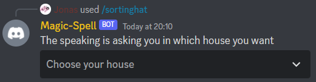
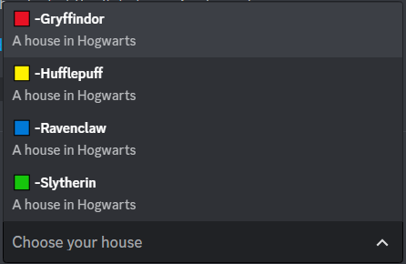
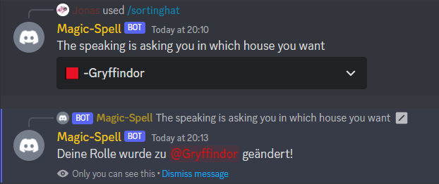

# DiscordModBot
Discord Bot for modding and much more.

## Features

### Default-role

The bot give user who join the server, the default-role.

### Role-toggle

Users can toggle their role in the role toggle. Here some Screenshots:






## SetUp

There 3 supported ways to run this bot:
- nodejs
- docker-compose
- kubernetes


### Nodejs

You need [npm](https://www.npmjs.com/) and [node](https://nodejs.org/) installed.

1. First clone this Repository
2. Setup ``token-config.json``
   1. create the file
   2. Put your bot token into it
3. Setup ``config.json``
   1. create the file
   2. Adjust the values
4. Run ``npm install``
5. Run ``npm run build``
6. Run ``node dist/index.js``


### Docker

Make shure you have [docker](https://docker.com/) with [docker-compose](https://docs.docker.com/compose/) installed.

1. First get the ``docker-compose.yml``
2. Setup ``token-config.json``
   1. create the file
   2. Put your bot token into it
3. Setup ``config.json``
   1. create the file
   2. Adjust the values
4. Run ``docker compose up``


### Kubernetes

You only need [kubectl](https://kubernetes.io/docs/reference/kubectl/).

Use the ``example-...`` files from the ``kubernetes`` folder
1. token-config.json
   1. Put your bot token into it ``example-token-config-map.yaml``
   2. Deploy ```kubectl apply -f example-token-config-map.yaml```
2. config.json
   1. Adjust values ``example-config-map.yaml``
   2. Deploy ```kubectl apply -f example-config-map.yaml```
3. Deploy the container ``kubectl apply -f example-deployment.yaml``


## Example token-config.json
You need to insert your bot-token in this config
```json
{
  "token": "your-token"
}
```

## Example config.json:
**Important:** Delete the comments *(everything what starts with ``// ``)*
```json5
{
  "clientId": "914132354212175915", // ID from bot
  "status": "online", // online, idle, dnd 
  "activity": "on Kubernetes",
  "activityType": 0, 
        // 0 = Playing {game}
        // 1 = Streaming {details} 
        // 2 = Listening to {name}
        // 3 = Watching {details}
        // 5 = Competing in {name}
  "guild": "843816498049056828", // guildID
  "defaultRole": "914137388362641419", // roleID from the default role
  "toggleRole": {
    "command": "sortinghat",
    "commandDescription": "Speaking hat",
    "commandPermission": {
      "roleIDs": ["914137059495653428"], // You can add more than one, example ["FIRST_ID", "SECOND_ID"] and so on...
      "usersIDs": ["398876120696619008"] // You can add more than one
    },
    "deleteDefaultRole": true, // on role toggle lose default role
    "selectorPlaceholder": "Choose your house",
    "messageContent": "The speaking is asking you in which house you want",
    "roles": [
      {
        "label": "\uD83D\uDFE5 -Gryffindor",
        "description": "A house in Hogwarts",
        "value": "gryffindor",
        "roleId": "949751202931941447"
      },
      {
        "label": "\uD83D\uDFE8 -Hufflepuff",
        "description": "A house in Hogwarts",
        "value": "hufflepuff",
        "roleId": "949751287296167967"
      },
      {
        "label": "\uD83D\uDFE6 -Ravenclaw",
        "description": "A house in Hogwarts",
        "value": "ravenclaw",
        "roleId": "949751323870494751"
      },
      {
        "label": "\uD83D\uDFE9 -Slytherin",
        "description": "A house in Hogwarts",
        "value": "slytherin",
        "roleId": "949751321538490388"
      }
    ]
  }
}
```
